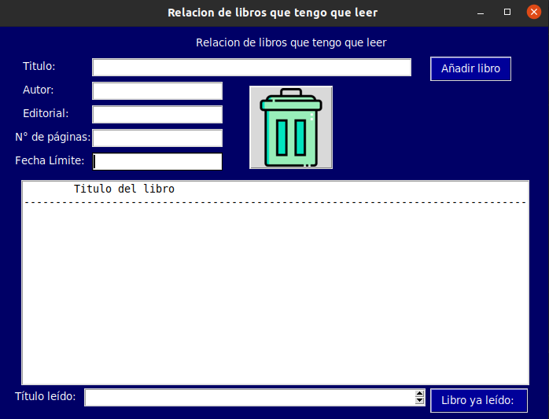
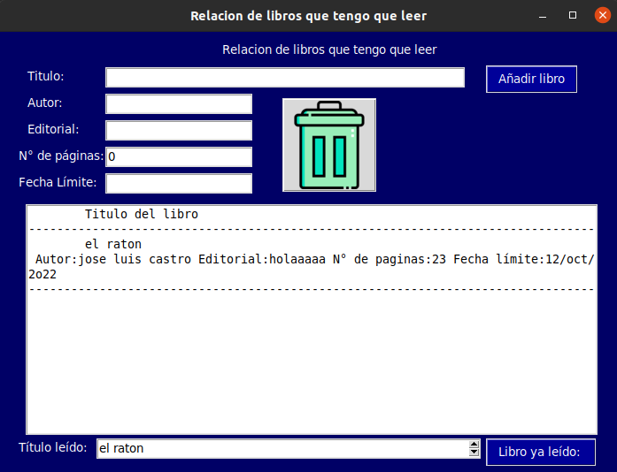
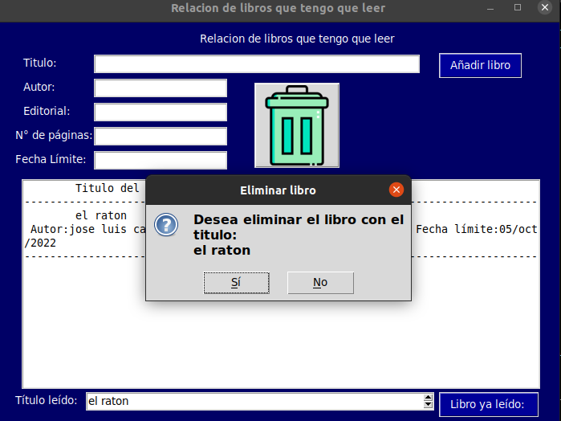
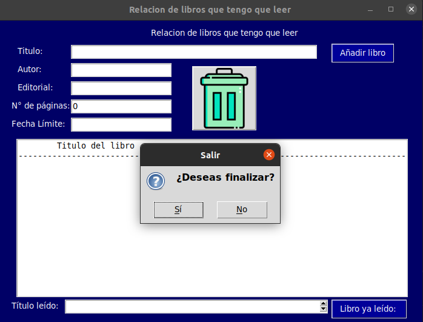

## PASO 1 (INTERFAZ)
### En esta interfaz se desarrollo una ventana para crear un libro con sus partes como autor o N de paginas etc.

## PASO 2 (DATOS)
### Luego de hacer lo del primer paso luego lo llenamos la interfaz de los datos que requieren para crear el libro.

## PASO 3  (OPCIONES)
### En este caso para quitar o eliminar el libro se le da a la opcion de la parte de abajo libro ya fue leido se le da click para que asi le salga una ventana de que si lo deseas eliminar.

## PASO 4 (SALIR)
### En este ultimo paso si deseas salir de la aplicacion le vas a dar click en la imagen de la basura para asi pueda salir una ventana y hay donde puedas estar seguro de salir 
